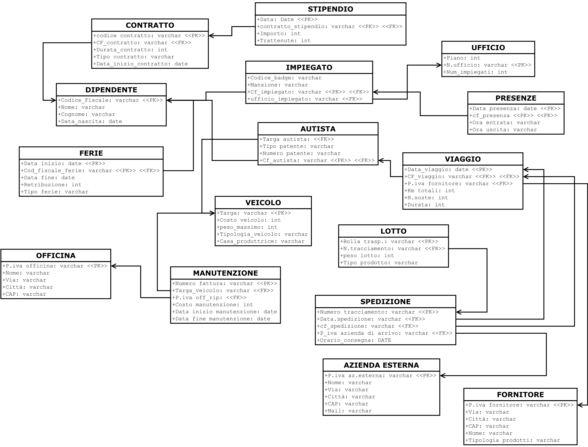

# TransportDatabaseManagement

## Project description
This project involves the design and implementation of a data management system for a transport company. The main objective is to create an efficient and well-structured database capable of managing all information related to the company's transport activities, including vehicles, drivers, shipments, customers, and more.

## Used technologies
The project was entirely developed using the following technologies:
* Relational database
* Structured Query Language (SQL)
* PL/SQL

## Entity Relationship Diagram

